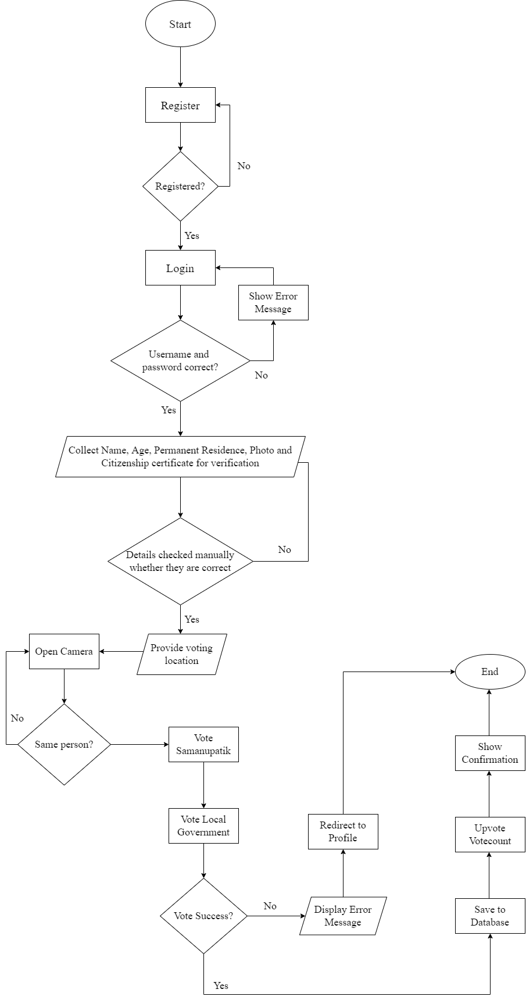
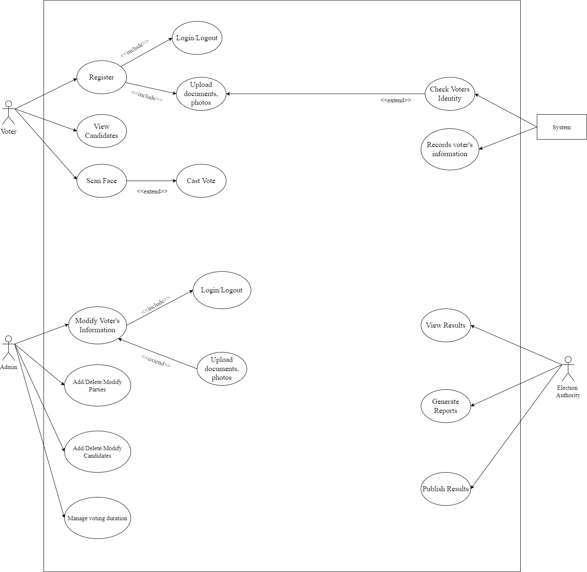

# Votiface Face Recognition 🔍

A comprehensive face recognition system built with Python, OpenCV, and the face_recognition library. This project includes both standalone Python scripts and a Django REST API for scalable face recognition operations.

[](https://github.com/utsavpaudel/votiface-facerecog/actions/workflows/ci.yml)
[](https://www.python.org/downloads/)
[](https://opensource.org/licenses/MIT)

---

## 🎯 Features

- **Face Detection**: Detect faces in images with high accuracy
- **Face Recognition**: Compare and match faces across different images
- **Face Encoding**: Generate 128-dimensional face embeddings
- **Django REST API**: RESTful endpoints for face recognition operations
- **Firebase Integration**: Authentication and data storage with Firebase
- **Docker Support**: Easy deployment with Docker and Docker Compose
- **CI/CD Pipeline**: Automated testing with GitHub Actions

---

## 🛠️ Tech Stack


**Core Libraries:**
- `face_recognition` - Face recognition library built on dlib
- `opencv-python` - Computer vision and image processing
- `numpy` - Numerical computing
- `Django` - Web framework for REST API
- `djangorestframework` - API toolkit

---

## 📦 Installation

### Option 1: Local Installation

1. **Clone the repository**
   ```bash
   git clone https://github.com/utsavpaudel/votiface-facerecog.git
   cd votiface-facerecog
   ```

2. **Create a virtual environment**
   ```bash
   python -m venv venv
   source venv/bin/activate  # On Windows: venv\Scripts\activate
   ```

3. **Install dependencies**
   ```bash
   pip install -r requirements.txt
   ```

### Option 2: Docker Installation

1. **Clone the repository**
   ```bash
   git clone https://github.com/utsavpaudel/votiface-facerecog.git
   cd votiface-facerecog
   ```

2. **Build and run with Docker Compose**
   ```bash
   docker-compose up --build
   ```

---

## 🚀 Usage

### Standalone Face Recognition

The `Votiface/` directory contains standalone Python scripts for face recognition:

```python
import face_recognition
import cv2

# Load images
image1 = face_recognition.load_image_file("person1.jpg")
image2 = face_recognition.load_image_file("person2.jpg")

# Get face encodings
encoding1 = face_recognition.face_encodings(image1)[0]
encoding2 = face_recognition.face_encodings(image2)[0]

# Compare faces
results = face_recognition.compare_faces([encoding1], encoding2)
distance = face_recognition.face_distance([encoding1], encoding2)

print(f"Match: {results[0]}")
print(f"Distance: {distance[0]:.2f}")
```

### Django REST API

The `votiface_django/` directory contains a Django REST API with the following endpoints:

#### 1. Generate Face Encoding

**Endpoint:** `POST /api/get-encode/`

**Request:**
```bash
curl -X POST http://localhost:8000/api/get-encode/ \
  -F "profileImage=@path/to/image.jpg"
```

**Response:**
```json
{
  "encode": [0.123, -0.456, 0.789, ...]
}
```

#### 2. Check Face Match

**Endpoint:** `POST /api/check-face/`

**Request:**
```bash
curl -X POST http://localhost:8000/api/check-face/ \
  -F "inputImage=@path/to/image.jpg" \
  -F "idToken=YOUR_FIREBASE_TOKEN"
```

**Response:**
```json
{
  "faceID": true
}
```

### Running the Django API

1. **Navigate to the Django directory**
   ```bash
   cd votiface_django
   ```

2. **Apply migrations**
   ```bash
   python manage.py migrate
   ```

3. **Run the development server**
   ```bash
   python manage.py runserver
   ```

4. **Access the API**
   ```
   http://localhost:8000/api/
   ```

---

## 🐳 Docker Usage

### Standalone Face Recognition

```bash
docker-compose run votiface python Votiface/facerecog.py
```

### Django API

```bash
docker-compose up django-api
```

The API will be available at `http://localhost:8000`

---

## 📁 Project Structure

```
votiface-facerecog/
├── Votiface/                  # Standalone face recognition scripts
│   ├── facerecog.py          # Main face recognition script
│   ├── checkfaces.py         # Face comparison utilities
│   ├── requirements.txt      # Python dependencies
│   ├── ImageBasic/           # Sample images for testing
│   └── VotedPeople/          # Database of known faces
├── votiface_django/          # Django REST API
│   ├── face_recognition_api/ # Face recognition endpoints
│   ├── account_api/          # User authentication
│   ├── manage.py             # Django management script
│   └── requirements.txt      # API dependencies
├── .github/
│   └── workflows/
│       └── ci.yml            # GitHub Actions CI/CD
├── Dockerfile                # Docker configuration
├── docker-compose.yml        # Docker Compose setup
├── requirements.txt          # Project-wide dependencies
├── pyproject.toml            # Python project metadata
├── .gitignore                # Git ignore rules
└── README.md                 # This file
```

---

## 🔧 Configuration

### Firebase Setup (for Django API)

1. Create a Firebase project at [Firebase Console](https://console.firebase.google.com/)
2. Download your Firebase configuration
3. Update `votiface_django/votiface_django/firebase.py` with your credentials

```python
# Example Firebase configuration
config = {
    "apiKey": "YOUR_API_KEY",
    "authDomain": "YOUR_PROJECT.firebaseapp.com",
    "databaseURL": "https://YOUR_PROJECT.firebaseio.com",
    "storageBucket": "YOUR_PROJECT.appspot.com"
}
```

---

## 🧪 Testing

Run tests with pytest:

```bash
pytest tests/ -v
```

Run with coverage:

```bash
pytest tests/ --cov=Votiface --cov-report=html
```

---

## 📊 How It Works

### Face Recognition Pipeline

1. **Face Detection**: Locate faces in images using HOG (Histogram of Oriented Gradients) or CNN
2. **Face Alignment**: Normalize face orientation and position
3. **Face Encoding**: Generate 128-dimensional embeddings using deep learning
4. **Face Comparison**: Calculate Euclidean distance between embeddings
5. **Match Decision**: Determine if faces match based on distance threshold (default: 0.6)

### Architecture Diagrams


*System flowchart showing the face recognition process*


*Use case diagram for the application*

---

## 🤝 Contributing

Contributions are welcome! Here's how you can help:

1. Fork the repository
2. Create a feature branch (`git checkout -b feature/AmazingFeature`)
3. Commit your changes (`git commit -m 'Add some AmazingFeature'`)
4. Push to the branch (`git push origin feature/AmazingFeature`)
5. Open a Pull Request

### Development Setup

```bash
# Install development dependencies
pip install -r requirements.txt

# Run linting
ruff check .

# Format code
black .
```

---

## 📝 License

This project is licensed under the MIT License - see the [LICENSE](LICENSE) file for details.

---

## 👨‍💻 Author

**Utsav Paudel**
- GitHub: [@utsavpaudel](https://github.com/utsavpaudel)
- Email: utsavpaudel111@gmail.com
- LinkedIn: [utsavpaudel](https://www.linkedin.com/in/utsavpaudel/)

---

## 🙏 Acknowledgments

- Built with [face_recognition](https://github.com/ageitgey/face_recognition) by Adam Geitgey
- Uses [dlib](http://dlib.net/) for face detection and recognition
- Powered by [OpenCV](https://opencv.org/) for image processing
- API built with [Django REST Framework](https://www.django-rest-framework.org/)

---

## 📈 Future Enhancements

- [ ] Add real-time face recognition from webcam
- [ ] Implement face clustering and grouping
- [ ] Add face emotion detection
- [ ] Create web-based UI for face management
- [ ] Optimize performance for large-scale recognition
- [ ] Add support for multiple face detection backends
- [ ] Implement face mask detection
- [ ] Add age and gender estimation

---

⭐ **Star this repo if you find it useful!**
